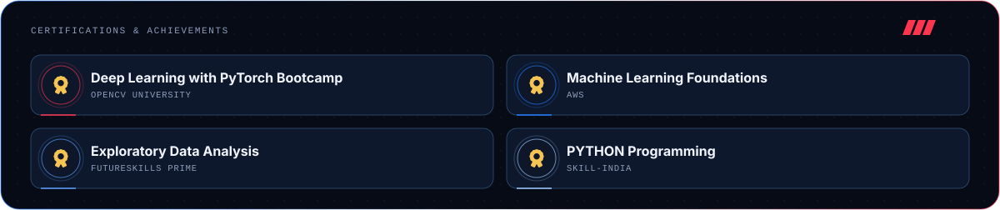
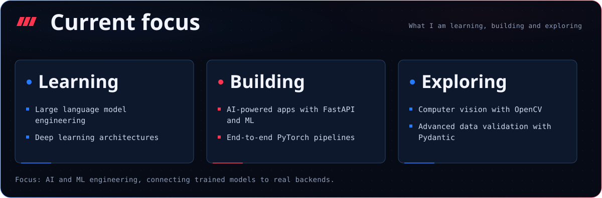

  

| PLATFORM | LINK |
| :-- | :-: |
| **LinkedIn** |  |
| **Email** |  |
| **Resume** |  |
| **GitHub** |  |

  

  

  

  

  

| PROJECT | DEMO | SOURCE |
| :-- | :-: | :-: |
| **SignAssist** |  |  |
| **TicketIQ** |  |  |
| **JobHunter** |  |  |
| **Customer Churn Prediction** |  |  |
| **Laptop Price Prediction** |  |  |
| **ShopEase** |  |  |

  

   
  

  

  

  

